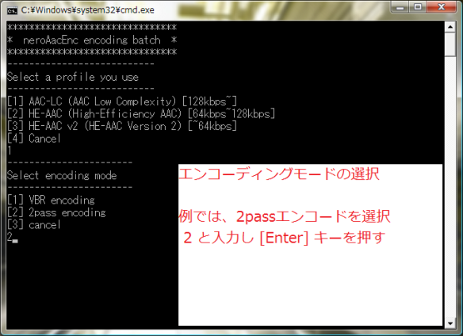

# neroAacEncバッチファイル

とりあえず、NeroAACエンコーダの面倒な使い方なんかどうでもいいから  
手っ取り早く、簡単に AAC にエンコードする方法。

## 必要となるもの

1. NeroAacEnc
2. エンコードバッチファイル(以下で説明)

## NeroAACエンコーダのダウンロード

まず、NeroAACエンコーダをダウンロード。

[http://ftp6.nero.com/tools/NeroAACCodec-1.5.1.zip](http://ftp6.nero.com/tools/NeroAACCodec-1.5.1.zip)

ダウンロード後、解凍。

## エンコードバッチファイルをダウンロード

このエンコードバッチファイルは、当方が自分用に作ったものです。
このバッチファイルの改編、再配布等はご自由にどうぞ。

ただ、これはあくまで自分用に作ったものを公開しているだけなので
このバッチファイルを使用した事によって、何らかの損害、不具合及び不利益が発生したとしても
当方は責任を負いかねますのでご了承下さい。

バッチファイルのダウンロードは[こちら](https://github.com/yumetodo/neroAacEnc_batch/releases)。

同様に、ダウンロード後、解凍。

## 準備

ダウンロードしたバッチファイルを NeroAacEnc があるフォルダに入れます。

neroAacEnc_batch.batとneroAacEnc.exeが同じフォルダーにある必要があります。もしくはバッチファイルを編集する必要があります。(`set EXEFILEPATH=`の部分)

準備はこれで完了

後は、エンコードしたい 16bit WAVファイルを  
バッチファイルにドラック＆ドロップするとコマンドプロンプトが開くので  
好みのエンコード設定にしてエンコードするだけ。

## 使い方

neroAacEnc_batch.batにWAVファイルをD&Dするだけでコマンドプロンプトが立ち上がります。

入力できるのは16bit WAVファイルです。拡張子が.wavでないときは即終了します。

エンコード設定は、設定したい項目の半角数字を入力して [Enter] を押すだけなので簡単。

個人的には  
[1]→[1]→[0.60]  
でいいと思うのですが・・・。

エンコードが開始される。
終了するまで待つ。

終了し、画面が消えたら無事完了。

## エンコード出来ない場合

エンコードが出来ない場合、まずファイル名に半角スペースが入っていないかよく確認して下さい。  
半角スペースを含むファイル名だとエンコード出来ません。

以上お疲れ様でしたー(・ω・)ﾉ

## アンインストール

一式削除するだけです。

## このバッチについて

そもそも、銀メモ -SilveryMemo-氏が  
[http://silverymemo.wordpress.com/2011/07/28/neroaac-batch/](http://silverymemo.wordpress.com/2011/07/28/neroaac-batch/)  
で公開されたバッチファイルです。

ですが私の環境では動かなかったのと、出力場所がバッチファイルと同じなのが嫌なので編集しました。

## メモ

`-ignorelength`を常に指定することでなにか悪影響があるかも。うん、知らん。

## その他の関連記事

- [Nero AAC エンコーダの使い方](https://silverymemo.wordpress.com/2011/04/01/how-to-neroaacenc/)
- [NeroAACエンコーダのオプション一覧](https://silverymemo.wordpress.com/2011/07/25/neroaac-options-list/)

[Creative Commons Attribution 2.1 Japan License](http://creativecommons.org/licenses/by/2.1/jp/)
[https://silverymemo.wordpress.com/2011/07/28/neroaac-batch/](https://silverymemo.wordpress.com/2011/07/28/neroaac-batch/)

